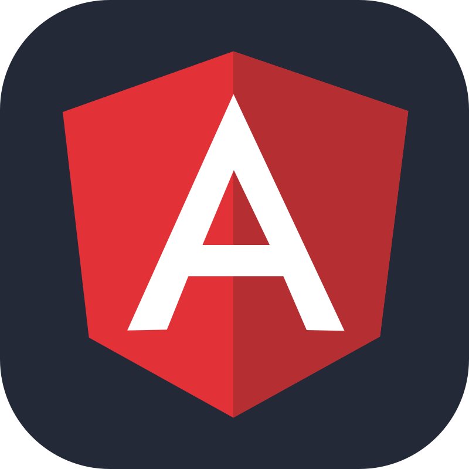

<br><br>
# Curso: Desenvolvimento Full Stack
## Mundo 2 - Nível 5 - Missão Prática

## Projeto: Configuração de Servidor com Express e Banco de Dados MongoDB

Este é um projeto acadêmico e consiste na configuração de um Servidor Node com Express e Mongoose, efetuando operações CRUDE em um Banco de Dados MongoDB.

O Banco de Dados irá armazenar um catálogo de livros, e serão configurados clientes React, Next.js e Angular para efetuar as operações CRUDE nos dados armazenados.

## Objetivos do Projeto

O objetivo é implementar um servidor baseado em Express e Mongoose, com acesso ao MongoDB, e, também efetuar a integração deste Servidor (Back-end) com Clientes (Front-ends) desenvolvidos em React, Next.js e Angular.

## Estrutura do Projeto
```
MUNDO_2_NIVEL_5-MISSAOPRATICA
│
├── clientes/ 
│   ├── livros-angular/              # Arquivos do Front-End Angular
│   ├── livros-next/                 # Arquivos do Front-End Next.js
│   └── livros-react/                # Arquivos do Front-End React
│
├── livro-servidor/                  # Arquivos do Back-End
│   ├── bin/
│   ├── controle/                    # Lógica de controle e serviços da aplicação
│   │   └── ControleEditora.ts       # Serviço de controle das editoras
│   │   └── ControleLivroService.ts  # Serviço de controle dos livros
│   ├── modelo/                      # Modelos e configuração do banco de dados
│   │   ├── conexao.js               # Configuração de conexão com o MongoDB
│   │   ├── Editoras.js              # Modelo da Classe Editoras (Array de Editoras)
│   │   ├── livro-dao.js             # Data Access Object com operações sobre 'Livro'
│   │   └── livro-schema.js          # Esquema do Mongoose para o modelo 'Livro'
│   ├── node_modules/
│   ├── public/                      # Arquivos estáticos (HTML, CSS, JS)
│   ├── routes/                      # Definição de rotas da API
│   │   ├── index.js                 # Rota principal
│   │   ├── livros.js                # Rotas relacionadas aos livros (GET, POST, DELETE)
│   │   └── users.js                 # Rota de usuários (opcional)
│   ├── views/                       # Templates de visualização (se necessário)
│   │   ├── error.ejs                # Página de erro
│   │   └── index.ejs
│   ├── app.js                       # Arquivo principal do servidor
│   ├── package-lock.json             
│   └── package.json                 # Dependências do Node.js e scripts do projeto
│
├── src/
│   └── assets/
│       └── images/                  # Imagens utilizadas no README
│
└── README.md                        # Documentação do projeto
```
## Requisitos

- Node JS (versão 16.20.2 ou superior)
- bootstrap (versão 5.3.3 ou superior)
- Angular CLI (versão 16.2.1 ou superior)
- Angular (Versão 16.2.12 ou superior)
- Next.js (versão 13.5.7 ou superior)
- React (verão 18 ou superior)
- MongoDB (verão v5.0.30 ou superior)
- Express (verão v4.16.4 ou superior)
- Express.Router (verão v4.16.4 ou superior)
- CORS (verão v2.8.5 ou superior)
- Mongoose (verão v8.7.3 ou superior)

## Tecnologias Utilizadas

: Framework para construção de aplicações web.<br>
: O Next.js é um framework que permite criar aplicações web e sites fullstack com React e JavaScript.<br>
: React é um framework JavaScript que é usado para criar interfaces de usuário (UI) em aplicativos web.<br>
: Superset do JavaScript que adiciona tipagem estática.<br>
: Framework CSS para estilização e layout.<br>
: Editor de código utilizado no desenvolvimento.<br>
: Para armazenamento dos códigos e controle de versões.<br>
: Ambiente de execução para JavaScript no lado do servidor.<br>
:  Banco de dados NoSQL orientado a documentos.<br>
: Interface gráfica oficial do MongoDB.<br>
: Ferramenta de desenvolvimento de API que permite aos usuários testar, documentar e interagir com APIs.<br>

## Organização do código e Funcionalidades: 

Esta é uma aplicação funcional que permite visualizar, adicionar e excluir livros em um Banco de Dados.

Efetua a navegação interna entre as páginas de lista e cadastro de livros.
Implementa serviços e gerenciamento de formulários.

A estrutura implementada atende aos requisitos fornecidos e serve como base para expandir funcionalidades ou aplicar ajustes adicionais.

Cada Font-End desenvolvido no projeto (React, Next.js e Angular) possui sua própria pasta, dentro da pasta `clientes`.

### Funcionalidades 

- **Backend**: Obtenção, inclusão e exclusão de livros.
- **Frontend**: Interfaces em React, Next.js e Angular para o gerenciamento dos livros.

**Obtenção de Livros**: Exibe uma tabela com todos os livros cadastrados, permitindo exclusão.

**Inclusão de Livros**: Formulário para adicionar novos livros ao catálogo.

**Exclusão de Livros**: Elimina o livro selecionado do catálogo.

### Testes/Execução

Verifique as funcionalidades de listagem e inclusão de livros. Utilize o navegador para acessar as diferentes rotas da aplicação.

**Servidor**: Acesse o endereço *http://localhost:3030* no seu navegador.

**Cliente React**: Acesse o endereço *http://localhost:3000* no seu navegador. 

**Cliente Next**: Acesse o endereço *http://localhost:3000* no seu navegador. 

**Cliente Angular**: Acesse o endereço *http://localhost:4200* no seu navegador.

## Licença

Este projeto é de domínio público. Sinta-se à vontade para utilizá-lo e modificá-lo conforme necessário.

Acesse e Clone o repositório em https://github.com/CarlosCatao/Mundo_2_Nivel_5-MissaoPratica/tree/main/clientes ou faça o download do código.

### Autor

[<br><sub>Carlos Automare Catão</sub>](https://github.com/CarlosCatao)]
