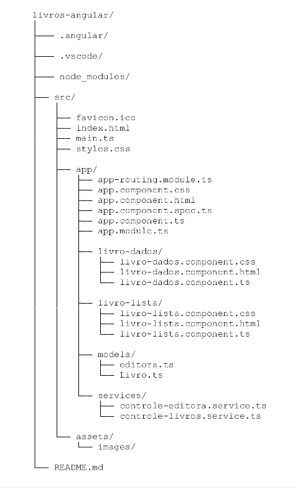
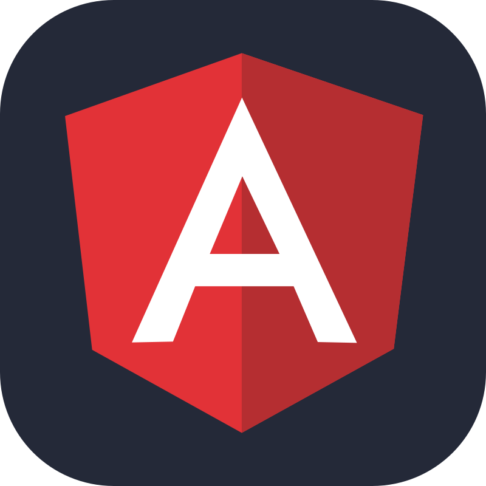

  
# Curso: Desenvolvimento Full Stack
## Mundo 2 - Nível 4 - Missão Prática

## Projeto: Livros Angular

Este é um projeto acadêmico e consiste em um catálogo de livros desenvolvido com o framework Angular, utilizando TypeScript.

## Objetivos do Projeto

O objetivo é implementar serviços injetáveis no Angular, criar componentes utilizando TypeScript e HTML para exibição e entrada de dados, além de utilizar a biblioteca Angular Forms para gerenciar formulários e implementar navegação interna no front-end com o Angular Routing.

## Estrutura do Projeto

## Requisitos

- Node JS (versão 16.20.2 ou superior)
- bootstrap (versão 5.3.3 ou superior)
- Angular CLI (versão 16.2.1 ou superior)
- Angular (Versão 16.2.12 ou superior)

## Tecnologias Utilizadas

: Framework para construção de aplicações web. 
: Superset do JavaScript que adiciona tipagem estática. 
: Framework CSS para estilização e layout. 
: Editor de código utilizado no desenvolvimento. 
: Para armazenamento dos códigos e controle de versões. 
: Ambiente de execução para JavaScript no lado do servidor. 

## Organização do código e Funcionalidades: 

Esta é uma aplicação funcional que permite visualizar, adicionar e excluir livros.
 Efetua a navegação interna entre as páginas de lista e cadastro de livros.
Implementa serviços e gerenciamento de formulários.

### Funcionalidades 

**Listagem de Livros**: Exibe uma tabela com todos os livros cadastrados, permitindo exclusão.

**Inclusão de Livros**: Formulário para adicionar novos livros ao catálogo.

### Entidades

**Editora**: Representa uma editora, com atributos codEditora e nome.

**Livro**: Representa um livro, com atributos codigo, codEditora, titulo, resumo e autores.

### Controladores de Serviços

**ControleEditora**: Gerencia as operações relacionadas às editoras.

**ControleLivros**: Gerencia as operações relacionadas aos livros, incluindo listagem, inclusão e exclusão.

## Uso

### Iniciar o Servidor

ng serve

### Testes/Execução

Verifique as funcionalidades de listagem e inclusão de livros. Utilize o navegador para acessar as diferentes rotas da aplicação.

Acesse o endereço *http://localhost:4200* no seu navegador.

## Licença

Este projeto é de domínio público. Sinta-se à vontade para utilizá-lo e modificá-lo conforme necessário.

Clone ou acesse o repositório https://github.com/CarlosCatao/Mundo_2_Nivel_4-MissaoPratica ou e faça o download do código.

## Development server

### Autor

[ Carlos Automare Catão](https://github.com/CarlosCatao)]