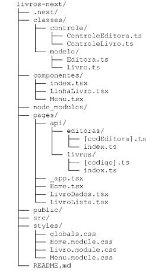
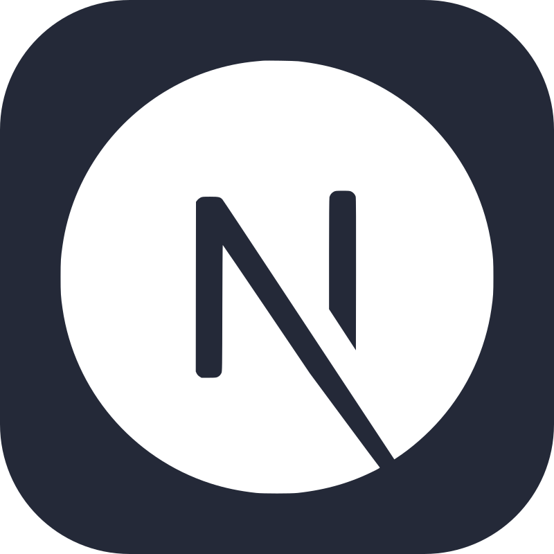
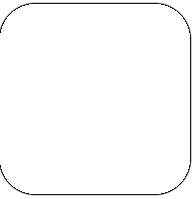

  
# Curso: Desenvolvimento Full Stack
## Mundo 2 - Nível 3 - Missão Prática

## Projeto: Livros Next

Este é um projeto didático com fins de criar uma aplicação web desenvolvida com Next.js e TypeScript para gerenciar um catálogo de livros. O aplicativo se comunica com uma API interna para realizar operações *CRUD (Create, Read, Update, Delete)* sobre livros e editoras.

## Objetivos do Projeto

* Explorar a ciação de um *front-end* baseado em **Next JS**;
* Definição e manipulação de **API HTTP** interna.

## Estrutura do Projeto

  
 
## Requisitos

- Next JS (versão 13.5.7 ou superior)
- Node JS (verão 10.9.0 ou superior)
- bootstrap (verão 5.3.3 ou superior)
- react (verão 18 ou superior)

## Tecnologias Utilizadas
 
:  Bootstrap para facilitar o design *responsivo* e garantir que o site seja amigável em dispositivos móveis. 
: Editor de código utilizado no desenvolvimento. 
: Para armazenamento dos códigos e controle de versões. 
: O Node.js é uma plataforma de desenvolvimento que permite interpretar código JavaScript e executar aplicações do lado do servidor. 
: O Next.js é um framework que permite criar aplicações web e sites fullstack com React e JavaScript. 
: React é um framework JavaScript que é usado para criar interfaces de usuário (UI) em aplicativos web. 
: Formato de dados utilizado para troca de informações. 

## Organização do código e Funcionalidades: 

### APIs

  

  

    <h3>Editoras</h3>
    

  

GET /api/editoras: Retorna uma lista de editoras.  
GET /api/editoras/[codEditora]: Retorna os detalhes de uma editora específica.

  

  

    <h3>Livros</h3>
    

  

GET /api/livros: Retorna uma lista de livros. 
POST /api/livros: Adiciona um novo livro. 
DELETE /api/livros/[codigo]: Exclui um livro específico.

### Componentes

  

  

    <h3>Menu</h3>
    

  

Componente de menu de navegação, implementado utilizando o Bootstrap e next/link para navegação entre as páginas.

  

  

    <h3>LinhaLivro</h3>
    

  

Componente que exibe as informações de um livro e inclui a funcionalidade para excluir o livro.

### Iniciar o Servidor

npm run dev

### Para Testar as APIs

Para testar a API, inicie o servidor com npm run dev e acesse:

http://localhost:3000/api/editoras
http://localhost:3000/api/editoras/3
http://localhost:3000/api/livros

### Para Executar a Aplicação

Para executar a aplicação, inicie o servidor com npm run dev e acesse a página inicial:

http://localhost:3000/Home

### Licença

Este projeto está licenciado sob a MIT License.

Clone ou acesse o repositório https://github.com/CarlosCatao/Mundo2_Nivel3-MissaoPratica/tree/main/livros-next ou e faça o download do código.

### Autor

[ Carlos Automare Catão](https://github.com/CarlosCatao)]