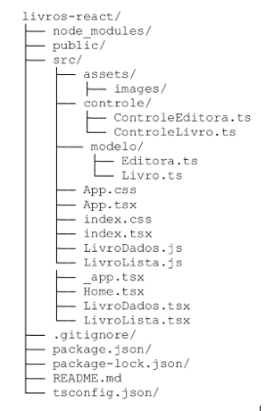

  
# Curso: Desenvolvimento Full Stack
## Mundo 2 - Nível 3 - Missão Prática

## Projeto: Livros React

Este é um projeto didático com fins de criar uma aplicação web desenvolvida com React e TypeScript para gerenciar um catálogo de livros. O objetivo é explorar a sintaxe do TypeScript e criar um front-end baseado em componentes reutilizáveis para realizar operações *CRUD (Create, Read, Update, Delete)* sobre livros e editoras.

## Objetivos do Projeto

* Explorar a sintaxe Type Script na implementação de entidades e controladores,
para projetos React JS;
* Criar um front-end para Web completo, baseado em componentes reutilizáveis,
através do React JS.

## Estrutura do Projeto

## Requisitos

- Node JS (versão 10.9.0 ou superior)
- bootstrap (versão 5.3.3 ou superior)
- react (versão 18 ou superior)
- react-dom (versão 18.3.1 ou superior)
- react-router-dom (verão 6.27.0 ou superior)

## Tecnologias Utilizadas

: Biblioteca para construir interfaces de usuário. 
: Superset do JavaScript que adiciona tipagem estática. 
: Framework CSS para estilos responsivos. 
: Biblioteca para gerenciamento de rotas. 
: Editor de código utilizado no desenvolvimento. 
: Para armazenamento dos códigos e controle de versões. 
: O Node.js é uma plataforma de desenvolvimento que permite interpretar código JavaScript e executar aplicações do lado do servidor. 

## Organização do código e Funcionalidades: 

### Funcionalidades 

**Listagem de Livros**: Exibe uma tabela com todos os livros cadastrados, permitindo exclusão.

**Inclusão de Livros**: Formulário para adicionar novos livros ao catálogo.

### Navegação
Utiliza o *React Router* para navegar entre a **listagem de livros** e a **página de inclusão**.

### Entidades

**Editora**: Representa uma editora, com atributos codEditora e nome.

**Livro**: Representa um livro, com atributos codigo, codEditora, titulo, resumo e autores.

### Controladores
**ControleEditora**: Gerencia as operações relacionadas às editoras.

**ControleLivros**: Gerencia as operações relacionadas aos livros, incluindo listagem, inclusão e exclusão.

## Uso

### Iniciar o Servidor

npm start

### Testes/Execução

Verifique as funcionalidades de listagem e inclusão de livros. Utilize o navegador para acessar as diferentes rotas da aplicação.

Acesse o endereço http://localhost:3000 no seu navegador.

## Licença
Este projeto é de domínio público. Sinta-se à vontade para utilizá-lo e modificá-lo conforme necessário.

Clone ou acesse o repositório https://github.com/CarlosCatao/Mundo2_Nivel3-MissaoPratica/tree/main/livros-react ou e faça o download do código.

### Autor

[ Carlos Automare Catão](https://github.com/CarlosCatao)]